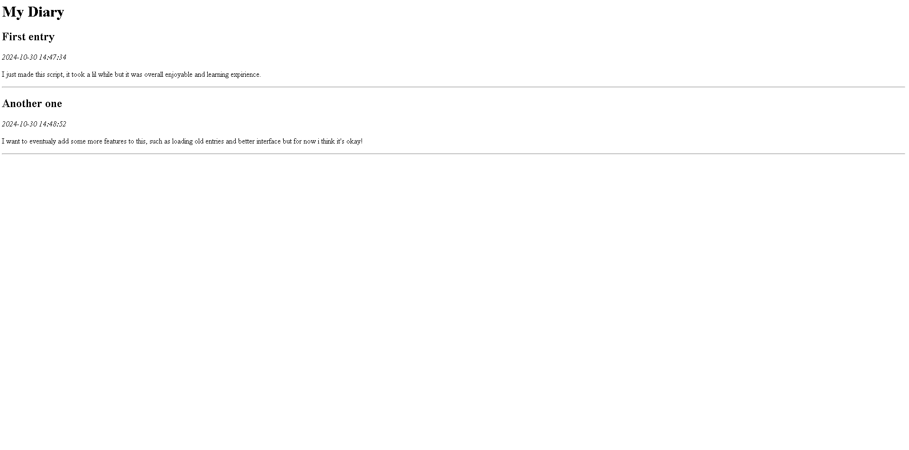

# Personal Diary Application

**Personal Diary Application** is a simple command-line diary tool designed to allow users to record, view, and generate an HTML summary of their diary entries. This project serves as a basic proof-of-concept for practicing Python programming and object-oriented design. I intend to expand the usability of this tool as I get more time as of right now this is just a skeleton.

---

### Table of Contents
1. [Overview](#overview)
2. [Features](#features)
3. [Installation](#installation)
4. [Usage](#usage)
5. [Examples](#examples)
6. [Contributing](#contributing)
7. [License](#license)

---

## Overview

The Personal Diary Application provides a straightforward interface for users to add diary entries, view existing entries, and create an HTML summary of their diary. The project showcases the use of Python classes, lists, and basic file handling. It is designed for educational purposes and can serve as a foundation for more complex applications.

## Features

- **Add Diary Entry:** Users can create a new entry with a title and content.
- **View Entries:** Display all diary entries with timestamps.
- **Generate HTML Summary:** Create an HTML file summarizing all diary entries.
- **Exit Application:** Gracefully exit the program.

---

## Installation

To run this application, ensure you have Python installed on your machine. You can clone or download the project files and run the script directly.

---

## Usage

To use the Personal Diary Application, run the script from the command line and follow the prompts:

```python main.py```

After running, you will see a menu with options to add entries, view them, generate an HTML summary, or exit the application.

---

## Examples

1. **Add Entry**
   - User is prompted to enter the title and content.
   
   Example input:
   Enter the title of the entry: My First Entry
   Enter the content of the entry: Today was a good day!
   
   Output:
   Entry added!

2. **View Entries**
   - All entries with timestamps are displayed.
   
   Example output:
   1. 2024-10-30 12:00:00 - My First Entry
      Today was a good day!

3. **Generate HTML Summary**
   - Creates an HTML file named diary_entries.html with all entries.
   
   Output:
   HTML summary generated: diary_entries.html

---
**HTML Diary Showcase**
    
---

## Contributing

Contributions are welcome! Feel free to suggest improvements, submit pull requests, or report issues. This project is aimed at learning and experimentation, so any enhancements that increase its educational value are appreciated.

---

## License

This project is open-source and available under the MIT License.
